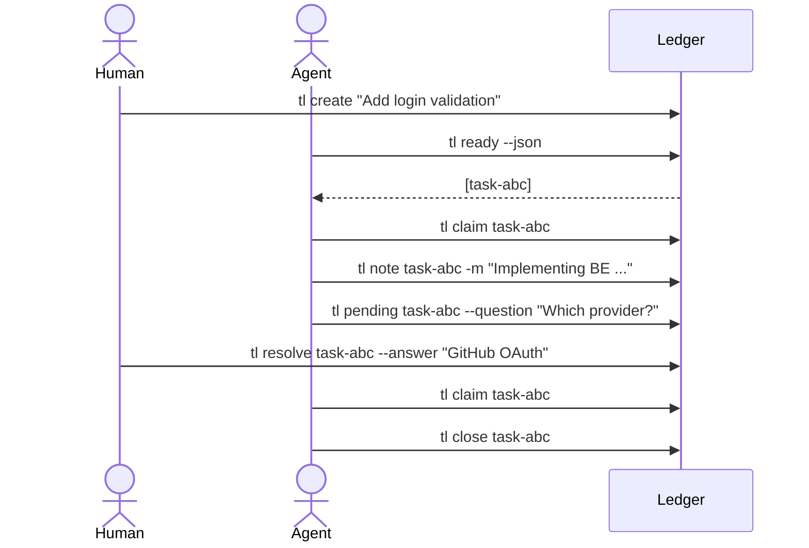

# tl tool - Taks ledger for your repository

> A Git-native task ledger for humans and AI coding agents.

Task ledger (`tl`) stores tasks as Markdown files with YAML frontmatter inside your repository, gives agents a dependency-aware ready queue, supports safe claim leases with automatic actor resolution, and records every change in an append-only event journal. The Handover work between agents (humans) can be task/story centric by utilizing notes feature.

No daemon. No hidden database. No automatic push. No AGENTS.md magic.

---

## Install

### Homebrew (macOS / Linux)

```sh
brew install aholbreich/tap/tl           # latest stable release
brew install --HEAD aholbreich/tap/tl    # or: build from current main
```

If you install multiple tools from the same tap, you can tap once:

```sh
brew tap aholbreich/tap
brew install tl
```

Prebuilt binaries are available for **macOS (Intel + Apple Silicon)** and **Linux (amd64 + arm64)**.

### RPM (Fedora / Red Hat)

Add the Holbreich RPM repository:

```sh
# Documentation: https://aholbreich.github.io/rpm-repo/#installation-fedora-centos-redhat
echo '[Holbreich]
name=Holbreich Repository
baseurl=https://aholbreich.github.io/rpm-repo/
enabled=1
gpgcheck=0' | sudo tee /etc/yum.repos.d/holbreich.repo
```

Install TaskLedger:

```sh
sudo dnf install taskledger
tl --version
```

If you run into issues with the RPM repository, see the
[rpm-repo project](https://github.com/aholbreich/rpm-repo).

### From source

```sh
git clone https://github.com/aholbreich/taskledger
cd taskledger
make install                # installs `tl` to $HOME/bin
```

Cross-platform release archives:

```sh
make dists                  # tl-linux-amd64.tar.gz, tl-darwin-arm64.tar.gz, …
```

---

## Quickstart

```sh
tl init                                                          # one-time per repo
tl create "Add login form validation"
tl create "Refactor auth errors" -t chore -p low --tag auth
tl list
tl show <id>                                                     # full id or bare short code
```

Agent workflow:

```sh
tl ready --json                                                  # what's available?
tl claim <id>                                                    # take a lease (actor auto-detected)
tl show <id>                                                     # read the details
tl note <id> -m "Initial implementation done."                   # record a handoff note
tl close <id>                                                    # mark as done
```

## Workflow reasoning

An example full collaboration loop - including a handoff back to the human when the
agent needs a decision could looks like this:



Actor identity resolves in order: `--actor` flag > `TL_ACTOR` env >
`ACTOR_NAME` env > `BEADS_ACTOR` env > agent auto-detection.

---

## Commands

- Flag reference: [`docs/COMMANDS.md`](docs/COMMANDS.md)
- Behavioral spec: [`features/`](features) (one `.feature` file per command)
- At the terminal: `tl <cmd> --help`

---

## Implementation status

Implemented commands carry the `@implemented` tag in their feature file.
`make bdd` runs only the implemented suite; untagged features are the
binding contract for unimplemented commands.

---

## Storage

```
.taskledger/
  config.yaml      # defaults
  tasks/
    task-<3>.md    # one file per task (Markdown + YAML frontmatter)
  events.jsonl     # append-only audit trail
```

A created task looks like:

```markdown
---
id: task-x3n
title: Add login validation
status: open
priority: medium
type: ""
created_at: 2026-05-17T00:45:40Z
updated_at: 2026-05-17T00:45:40Z
created_by: human
assignee: null
depends_on: []
claim:
  actor: null
  claimed_at: null
  expires_at: null
  heartbeat_at: null
tags: []
---

## Description

Validate email format and require a password.
```

As a task moves through its lifecycle, frontmatter and body gain fields.

A `pending_human` task records the question structurally so `tl resolve`
can consume it; the claim is released while waiting:

```yaml
status: pending_human
claim:
  actor: null
  claimed_at: null
  expires_at: null
  heartbeat_at: null
pending:
  question: Which OAuth provider should we ship first?
  requester: claude-code:frontend
  requested_at: 2026-05-17T01:15:22Z
```

A `blocked` task carries no extra frontmatter — the status is the signal,
and the blocker reason lives in the body as a normal note appended by
`tl block`:

```markdown
status: blocked
```

```markdown
## Notes

- 2026-05-17T02:11:08Z claude-code:main: Blocked — waiting on upstream
  library release (tracking GH issue 412).
```

---

## Exit codes

`0` success · `1` generic · `2` invalid args · `3` task not found ·
`4` task not ready · `5` already claimed · `7` lock failed

---

## Development

```sh
make build                  # version-stamped local binary
make test                   # all Go tests
make bdd                    # godog suite only
make dists                  # cross-platform release archives
make clean
```

CI runs `gofmt`, `go vet`, `make build`, `make test` on every PR and push to
`main` (see [`.github/workflows/ci.yaml`](.github/workflows/ci.yaml)).
Tag-triggered releases build all platforms and publish a GitHub Release.

---

## Further reading

- [`docs/COMMANDS.md`](docs/COMMANDS.md) — per-command flag reference
- [`docs/PRD.md`](docs/PRD.md) — design intent, non-goals, status enum
- [`features/`](features/) — Gherkin behavioral spec, one file per command
- [`AGENTS.md`](AGENTS.md) — leading doc for any agent working in this repo
- [`docs/gherkin-guidelines.md`](docs/gherkin-guidelines.md) — Gherkin style rules
